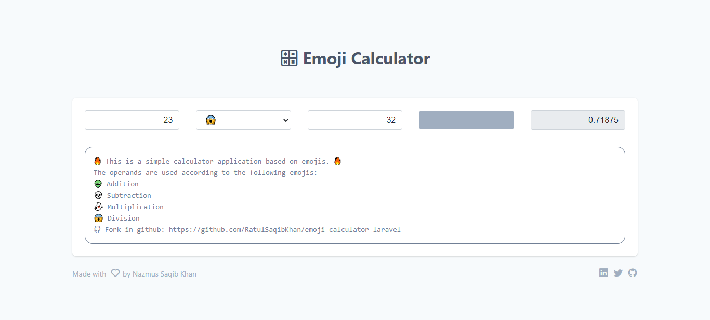

# About Emoji &#128640; Calculator &#128425;

- &#128293; This is a simple calculator application based on emojis. &#128293;
- The operands are used according to the following emojis:
- &#128125; Addition
- &#128128; Subtraction
- &#128123; Multiplication
- &#128561; Division

## Install Application using following steps
- Required [PHP](https://www.php.net/downloads.php) version 7.3 or above 
- Required [Composer](https://getcomposer.org/) 
- Clone or download the application to your pc/ laptop
- Open terminal/ command prompt and cd to the application root
- Run `composer install`
- Run `php artisan serve`
- The application should be served in `127.0.0.1:8000` according to your pc's port availabilty

## Application Screenshot

